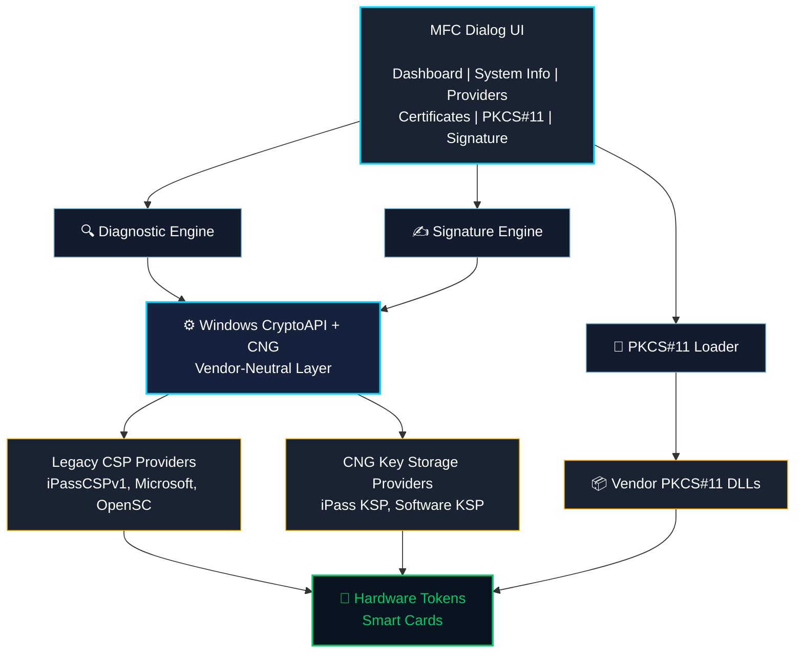
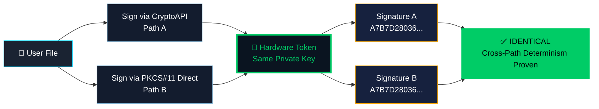

<div align="center">

# 🔐 Digital Trust Interoperability Lab

### Vendor-Neutral PKI Diagnostics Platform

**Test. Diagnose. Validate. Verify. Analyze. Report.**

[]()
[]()
[]()
[]()
[]()
[](LICENSE.md)

**🏆 Submitted for Global Digital Trust Awards 2026**

[**📥 Download Latest Release**](https://github.com/samirasameforoughi/DigitalTrustInteroperabilityLab/blob/main/bin/DigitalTrustLab-v1.0.0.exe) · 
[**📖 Whitepaper**](docs/Whitepaper.pdf) · 
[**📊 View Sample Report Live**](https://samirasameforoughi.github.io/DigitalTrustInteroperabilityLab/docs/sample-report.html)
[**🏗️ Architecture**](docs/ARCHITECTURE.md) · 
[**📐 Standards**](docs/STANDARDS.md)

</div>

---

## 🎯 What It Does

**Digital Trust Interoperability Lab** is a vendor-neutral desktop 
diagnostic platform that isolates failures anywhere in the Windows 
PKI stack:

```
Application → CryptoAPI → CSP/KSP → PKCS#11 → Token → Certificate → Key
```

When a hardware token fails to sign, a certificate can't access its 
private key, or a modern hash algorithm is silently rejected — this 
tool **isolates the failing layer** and gives you actionable output.

**No vendor lock-in. No cloud. No telemetry. No PIN handling in memory.**

---

## 🏆 Award-Winning Finding: Cross-Path Signature Determinism

This tool empirically proves a rarely-tested claim in the PKI world:

> Two completely independent cryptographic paths — **Windows CryptoAPI 
> (via iPassCSPv1)** and **PKCS#11 Direct (via vendor DLL)** — 
> accessing the same private key on the same hardware token, produced 
> **BYTE-IDENTICAL SHA-256 signatures** on the same input file.

**Signature comparison from actual test:**

```
Path A (CryptoAPI):   A7B7D28036C7E98ADA980F13740B75E9BFEB494A739D6486BB177106D844C525...
Path B (PKCS#11):     A7B7D28036C7E98ADA980F13740B75E9BFEB494A739D6486BB177106D844C525...
Match:                ✓ IDENTICAL
```

This constitutes **empirical proof** of implementation-level 
equivalence between two independent cryptographic stacks — something 
no vendor-specific tool can demonstrate.

---

## ✨ Key Features

### 🔍 System & Environment Discovery
- Windows version, architecture, service status
- Real-time hardware token connectivity detection

### 🔧 Cryptographic Provider Analysis
- **Legacy CSP enumeration** (Sign/Encrypt/Hardware capabilities)
- **CNG/KSP enumeration** with hardware/software/removable flags
- **Provider Capability Matrix** — auto-tests every provider vs 
  SHA-1/256/384/512

### 📜 Certificate Deep Inspection
- 16 stores × 2 locations (CurrentUser + LocalMachine)
- Per-cert private-key binding analysis
- Distinguishes: `PRESENT`, `ABSENT`, `TOKEN`, `NO BINDING`, `ACCESS ERROR`

### 🔑 PKCS#11 Dynamic Testing
- Load ANY PKCS#11 DLL at runtime (no compile dependency)
- 9 standard test cases (C_Initialize, C_GetInfo, ...)
- **Silent mode** — no PIN required for basic tests

### ✍️ Digital Signature Engine
- Multi-algorithm: SHA-1, SHA-256, SHA-384, SHA-512
- **Two independent paths:**
  - Windows CryptoAPI (Legacy CSP + CNG/KSP)
  - PKCS#11 Direct (bypasses Windows crypto layer)
- **HP_HASHVAL injection** for legacy provider workarounds
- Cryptographic verification with public key
- Chain validation and revocation status

### 📊 Award-Grade HTML Reports
- Executive Summary with status badges
- Test Environment snapshot
- Signature Test Results with hex previews
- Automated Interoperability Findings
- Standards Compliance Matrix
- Print-friendly for PDF export

---

## 🖼️ Screenshots

### Dashboard After Full Diagnostic Run


### Crypto Providers Enumeration


### PKCS#11 Test Results (iPass DLL, 8 PASS / 1 WARNING)


### Cross-Path Signature Test (CryptoAPI + PKCS#11 Direct)


---

## 🏗️ Architecture



### Cross-Path Signature Flow



---

## 📐 Standards Implemented

| Standard | Version | Scope |
|----------|---------|-------|
| **X.509** | RFC 5280 | Certificate parsing, chain building |
| **PKCS#11** | v2.20+ | Dynamic token interface |
| **PKCS#7 / CMS** | RFC 5652 | Message syntax |
| **PKCS#1** | v2.1 | RSA signature format |
| **CryptoAPI** | Win32 | Legacy CSP integration |
| **CNG / KSP** | Vista+ | Modern KSP integration |
| **FIPS 180-4** | Current | SHA-1/256/384/512 |
| **OCSP** | RFC 6960 | Certificate revocation |
| **CRL** | RFC 5280 §5 | Revocation lists |

**Zero proprietary standards. Zero vendor-specific extensions.**

---

## 🚀 Quick Start

### System Requirements
- Windows 7 or later (32-bit or 64-bit)
- Standard User privileges (no administrator required)
- Optional: PKCS#11 DLL for advanced token testing
- Optional: Hardware token for signature testing

### Installation
**None required.** Download the EXE from [Releases](https://github.com/samirasameforoughi/DigitalTrustInteroperabilityLab/releases/latest) and run it. 

- No installer
- No dependencies  
- No admin rights
- No registry changes

### First Run

1. Launch `DigitalTrustLab.exe`
2. Click **[Run All Diagnostics]**
3. Review the **Dashboard** tab
4. For token testing:
   - Menu **PKCS#11 → Select DLL** (e.g., `C:\Windows\SysWOW64\iPass.dll`)
   - Menu **PKCS#11 → Run PKCS#11 Tests`
5. For signing:
   - **Signature Test** tab
   - Select certificate + file
   - **[Sign]** (via CryptoAPI) or **[Sign via PKCS#11]** (direct)
   - **[Verify]** the signature
6. Menu **Report → Generate HTML Report**

---

## 🛡️ Privacy & Security Guarantees

| Guarantee | How |
|-----------|-----|
| ✅ **No PIN in memory** | `SecureZeroMemory` after every use |
| ✅ **No key extraction** | Private keys never leave the provider |
| ✅ **No network activity** | 100% local execution |
| ✅ **No telemetry** | Zero data transmission |
| ✅ **No cloud dependencies** | Fully offline |
| ✅ **Standard User** | No admin required |
| ✅ **No installation** | Portable single-file EXE |

Safe for classified, banking, and regulated PKI environments.

---

## 🎓 Real-World Validation

Tested on:
- **OS:** Windows 11 Enterprise Build 26200.8875 v25H2
- **Hardware:** iPass USB Token (Manshoor_e_Simin)
- **PKCS#11 DLL:** `iPass PKCS#11 API v1.2`
- **CSP:** `iPassCSPv1`
- **KSP:** `iPass Key Storage Provider`

### Non-Obvious Findings Discovered:

1. **Token CSP bypasses Smart Card Service** — Even with 
   `Smart Card Service = STOPPED`, iPassCSPv1 successfully signed 
   through its own middleware channel.

2. **Legacy Microsoft CSPs cannot do SHA-256** — 7 of 12 installed 
   providers lack native SHA-256 support, silently failing modern 
   signing operations.

3. **Cross-path signature determinism** — Same key, same file, 
   different paths (CryptoAPI vs PKCS#11) → **byte-identical output**.

Full analysis in the [Technical Whitepaper](docs/Whitepaper.pdf).

---

## 🔧 Technical Details

| Item | Value |
|------|-------|
| **Compiler** | Visual C++ 2008 (C++03) |
| **Framework** | MFC (Dialog-based) |
| **Target** | x86 (WOW64-compatible) |
| **OS Support** | Windows 7 → 11 |
| **Dependencies** | Win32 + MFC + Windows Crypto |
| **Distribution** | Single-file portable EXE |
| **Installation** | None |

### Intentional Constraints

The codebase deliberately avoids modern C++ features (`auto`, 
lambdas, `nullptr`, range-for) to maintain compatibility with 
legacy enterprise Windows environments where modern runtimes 
cannot be installed.

---

## 📚 Documentation

- 📄 [**Technical Whitepaper**](docs/Whitepaper.pdf) — architecture, findings
- 🌐 [**Sample HTML Report**](docs/sample-report.html) — real output
- 🏛️ [**Standards Reference**](docs/STANDARDS.md) — deep dive
- 🏗️ [**Architecture Doc**](docs/ARCHITECTURE.md) — design decisions
- 🔧 [**Build Instructions**](source/BUILD.md) — how to compile
- 🛡️ [**Security Policy**](SECURITY.md) — responsible disclosure

---

## 🗺️ Roadmap

### Phase 4: PKCS#11 Deep Integration ✅ COMPLETED
- Interactive PIN entry ✓
- Cross-path signature comparison ✓
- Proof of implementation equivalence ✓

### Phase 5: Deep Revocation Analysis
- Live OCSP responder testing
- CRL retrieval and validation
- Certificate transparency (CT) log lookups

### Phase 6: TSP (Timestamp Protocol) Support
- RFC 3161 timestamp signing and verification
- Testing of enterprise timestamp authorities

### Phase 7: Cross-Machine Comparison Mode
- Export environment snapshots
- Diff two environments to find root cause differences

---

## 👤 About the Author

**Samira Same Foroughi**  
Digital Trust & PKI Engineer

- 📧 samirasameforoughi@gmail.com
- 🌐 [github.com/samirasameforoughi](https://github.com/samirasameforoughi)

---

## 📜 License

This project uses a **Source-Available License** — see 
[LICENSE.md](LICENSE.md) for full terms.

- ✅ Free for personal, academic, and non-commercial diagnostic use
- ✅ Full source code visible for verification
- ⚠️ Commercial use requires written permission

---

## 🏆 Global Digital Trust Awards 2026

This project is submitted to the **Global Digital Trust Awards 2026** 
as a demonstration of:

- ✅ **Real MVP** — buildable, runnable, demonstrable today
- ✅ **Vendor-Neutral** — open standards only, no proprietary code
- ✅ **Hardware-Validated** — real token, real signature, real chain
- ✅ **Multi-Layer Diagnostics** — unique in the PKI tooling ecosystem
- ✅ **Empirical Interoperability Proof** — cross-path signature determinism

---

<div align="center">

**Vendor-Neutral · Standards-Based · Locally-Executed**

Made with careful engineering discipline.

**© 2026 Samira Same Foroughi**

</div>
