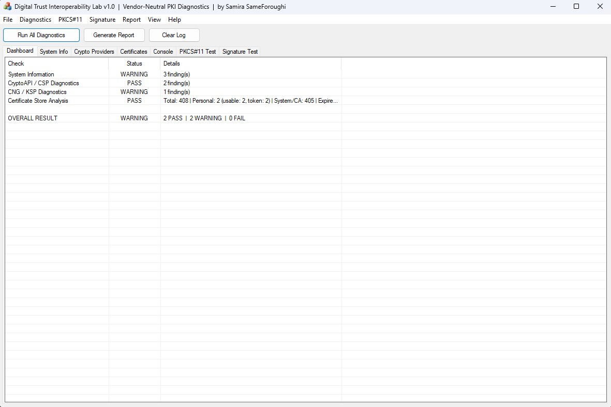

# 🔐 Digital Trust Interoperability Lab

### Vendor-Neutral PKI Diagnostics & Interoperability Platform

**Test. Diagnose. Validate. Verify. Analyze. Report.**

**🏆 Competition Submission — Global Digital Trust Awards 2026**

[**📥 Download Latest Release**](https://github.com/samirasameforoughi/DigitalTrustInteroperabilityLab/releases/latest) ·
[**📖 Technical Whitepaper**](docs/Whitepaper.pdf) ·
[**📊 Sample HTML Report**](https://samirasameforoughi.github.io/DigitalTrustInteroperabilityLab/docs/sample-report.html) ·
[**🏗️ Architecture**](docs/ARCHITECTURE.md) ·
[**📐 Standards**](docs/STANDARDS.md)

---

## Overview

**Digital Trust Interoperability Lab** is a vendor-neutral Windows desktop platform for diagnosing interoperability issues across the Windows PKI stack.

`Application → CryptoAPI / CNG → CSP / KSP → PKCS#11 → Token → Certificate → Private Key`

It is built to answer a practical engineering question:

> **Which layer is failing, and what evidence supports that conclusion?**

Typical diagnostic use cases include:

- hardware token signing failures
- certificate / private-key binding problems
- CSP / KSP capability mismatches
- PKCS#11 integration issues
- SHA-256 / SHA-384 / SHA-512 compatibility failures
- certificate chain and revocation diagnostics

**Local execution. No telemetry. Portable workflow.**

---

## Key Technical Finding

### Cross-Path Signature Consistency

The platform compares digital signatures produced through **two independent cryptographic access paths** to the same hardware-backed private key:

- **Path A:** Windows CryptoAPI via legacy CSP
- **Path B:** PKCS#11 direct via vendor PKCS#11 library

Under the documented test conditions, both paths produced **byte-identical SHA-256 signature output** for the same input and the same private key.

#### Observed result
Path A (CryptoAPI): A7B7D28036C7E98ADA980F13740B75E9BFEB494A739D6486BB177106D844C525...
Path B (PKCS#11): A7B7D28036C7E98ADA980F13740B75E9BFEB494A739D6486BB177106D844C525...
Comparison: ✓ BYTE-IDENTICAL

text

This is presented as an **empirical cross-path consistency result** for the tested token, provider configuration, signing mechanism, and input.

It is **not** presented as a universal proof that all implementations of CryptoAPI/CSP and PKCS#11 are equivalent.

See the [Technical Whitepaper](docs/Whitepaper.pdf) for methodology and test conditions.

---

## Screenshots

### Dashboard — Full Diagnostic Run

### Cryptographic Provider Enumeration

### PKCS#11 Test Results

### Cross-Path Signature Test

---

## Core Capabilities

### 🔍 System & Environment Discovery
- Windows version, build, and architecture detection
- WOW64 detection
- Cryptographic service visibility
- Hardware token connectivity checks
- Runtime environment snapshot

### 🔧 Cryptographic Provider Analysis
- Legacy CSP enumeration
- Provider type and capability inspection
- Sign / encrypt capability analysis
- CNG / KSP enumeration
- Hardware / software / removable classification
- Provider capability matrix
- SHA-1 / SHA-256 / SHA-384 / SHA-512 compatibility testing

### 📜 Certificate Deep Inspection
- Certificate store scanning across `Current User` and `Local Machine`
- Subject / issuer / validity analysis
- Key usage and enhanced key usage inspection
- Private-key association analysis
- Provider binding inspection
- Chain building and validation support

The tool distinguishes states such as:

`PRESENT` · `ABSENT` · `TOKEN` · `NO BINDING` · `ACCESS ERROR`

### 🔑 PKCS#11 Dynamic Testing
- Runtime loading of vendor PKCS#11 libraries
- No compile-time dependency on a specific token library
- Standard API diagnostics including `C_Initialize`, `C_GetInfo`, `C_GetSlotList`, `C_GetSlotInfo`, `C_GetTokenInfo`, `C_OpenSession`, `C_CloseSession`
- Basic diagnostics can run without PIN entry

### ✍️ Digital Signature Testing
- Signature generation through Windows CryptoAPI
- Signature generation through PKCS#11 direct path
- SHA-1 / SHA-256 / SHA-384 / SHA-512 testing
- Public-key signature verification
- Certificate chain inspection
- Revocation-related checks where applicable
- Controlled `HP_HASHVAL` handling for legacy provider compatibility testing

### 📊 HTML Diagnostic Reporting
- Executive summary with environment snapshot
- Provider inventory and capability matrix
- Certificate findings and PKCS#11 test results
- Signature comparison results with hex preview
- Standards / interface references
- Print-friendly HTML export

---

## Quick Start

### System Requirements
- Windows 7 or later (32-bit or 64-bit)
- Standard user privileges for core diagnostics
- Optional: PKCS#11 DLL for token testing
- Optional: Hardware token for signature testing

### Installation

No installer is required. Download and run:

[**📥 Download Latest Release**](https://github.com/samirasameforoughi/DigitalTrustInteroperabilityLab/releases/latest)

### First Run

1. Launch `DigitalTrustLab.exe`
2. Select **Run All Diagnostics**
3. Review the **Dashboard**, **Cryptographic Providers**, and **Certificates**
4. For PKCS#11 testing: **PKCS#11 → Select DLL** → run the test suite
5. For signature testing: **Signature Test** → select certificate and file → **Sign** → **Verify**
6. Generate the **HTML diagnostic report**

---

## Security & Privacy Design

| Property | Design |
|---|---|
| **Local execution** | Core diagnostics execute locally |
| **No telemetry** | No application telemetry is implemented |
| **No cloud dependency** | Core diagnostic functions do not require cloud services |
| **Private-key protection** | Private keys remain under provider / token control |
| **Sensitive buffer hygiene** | Relevant buffers are cleared after use where applicable |
| **No key extraction** | The diagnostic workflow does not export private keys |
| **Portable execution** | No installer is required for the distributed MVP |

> The tool should be evaluated against the security requirements of the target environment before deployment in regulated or high-assurance systems.

---

## Architecture

The application is organized around three main functional areas:

**Diagnostic Engine** — system discovery, provider inspection, certificate analysis

**Signature Engine** — CryptoAPI-based signing, PKCS#11 direct signing, cross-path output comparison, verification workflows

**PKCS#11 Loader** — dynamic vendor DLL loading, runtime function resolution, standard API testing

For diagrams and deeper design notes, see [docs/ARCHITECTURE.md](docs/ARCHITECTURE.md).

---

## Standards & Interfaces

| Standard / Interface | Reference | Scope |
|---|---|---|
| **X.509** | RFC 5280 | Certificate parsing and validation |
| **PKCS#11** | v2.20+ | Cryptographic token interface |
| **PKCS#7 / CMS** | RFC 5652 | Message syntax |
| **PKCS#1** | v2.1 | RSA signature structures |
| **Windows CryptoAPI** | Win32 | Legacy CSP integration |
| **CNG / KSP** | Windows Vista+ | Modern provider integration |
| **FIPS 180-4** | SHA family | Hash algorithms |
| **OCSP** | RFC 6960 | Certificate status checking |
| **CRL** | RFC 5280 §5 | Revocation list processing |

The platform is built around **standards-based interfaces** and operating-system cryptographic APIs, while allowing vendor PKCS#11 modules to be tested dynamically.

---

<strong>🔬 Real-World Validation (click to expand)</strong>

 

The MVP has been validated against a real Windows PKI environment.

**Test Environment**

- **OS:** Windows 11 Enterprise, Build 26200.8875, Version 25H2
- **Hardware:** iPass USB Token
- **PKCS#11:** iPass PKCS#11 API v1.2
- **CSP:** iPassCSPv1
- **KSP:** iPass Key Storage Provider

**Finding 1 — Independent Token Middleware Path**

During testing, the token CSP continued to perform cryptographic operations while the Windows Smart Card service was stopped, indicating the provider uses its own middleware path.

**Finding 2 — Legacy Provider Hash Compatibility**
12 providers tested
7 providers did not provide the expected native SHA-256 behavior

text

**Finding 3 — Cross-Path Signature Consistency**

The same private key and input produced byte-identical signature output through both Windows CryptoAPI / CSP and PKCS#11 direct access under the documented test conditions.

Additional details are provided in the [Technical Whitepaper](docs/Whitepaper.pdf).

---

<strong>🔧 Technical Details (click to expand)</strong>

 

| Item | Value |
|---|---|
| **Language** | C / C++ |
| **Compiler** | Visual C++ 2008 |
| **C++ Standard** | C++03-compatible |
| **Framework** | MFC / Win32 |
| **Target Architecture** | x86 |
| **WOW64** | Supported |
| **OS Target** | Windows 7 → Windows 11 |
| **Dependencies** | Win32, MFC, Windows Cryptographic APIs |
| **Distribution** | Portable executable |
| **Installation** | None required |

The codebase intentionally avoids `auto`, `nullptr`, lambdas, and range-based `for` to preserve compatibility with legacy enterprise Windows environments.

---

## Documentation

- 📄 [**Technical Whitepaper**](docs/Whitepaper.pdf) — methodology, findings, and test conditions
- 🌐 [**Sample HTML Report**](https://samirasameforoughi.github.io/DigitalTrustInteroperabilityLab/docs/sample-report.html) — example diagnostic output
- 📐 [**Standards Reference**](docs/STANDARDS.md) — standards and interfaces
- 🏗️ [**Architecture**](docs/ARCHITECTURE.md) — design and component structure
- 🔧 [**Build Instructions**](https://github.com/samirasameforoughi/DigitalTrustInteroperabilityLab/blob/main/docs/BUILD.md) — build steps
- 🛡️ [**Security Policy**](SECURITY.md) — responsible disclosure

---

## Roadmap

- [x] **Phase 4 — PKCS#11 Deep Integration** — interactive PIN entry, cross-path comparison
- [ ] **Phase 5 — Deep Revocation Analysis** — live OCSP, CRL validation
- [ ] **Phase 6 — Timestamp Protocol** — RFC 3161 generation and verification
- [ ] **Phase 7 — Cross-Machine Comparison** — environment diff and root-cause analysis

---

## Global Digital Trust Awards 2026

This project has been submitted to the **Global Digital Trust Awards 2026** as an engineering and research prototype demonstrating practical, vendor-neutral PKI interoperability diagnostics.

---

## About the Author

**Samira Same Foroughi** — Digital Trust & PKI Engineer

Specializing in digital signatures, PKI infrastructure, cryptographic tokens, PKCS#11, Windows CSP / CNG, and hardware-backed cryptography.

- 📧 samirasameforoughi@gmail.com
- 🌐 [github.com/samirasameforoughi](https://github.com/samirasameforoughi)

---

## License

**Source-Available License** — see [LICENSE.md](LICENSE.md) for full terms.

- ✅ Personal, academic, and non-commercial diagnostic use
- ⚠️ Commercial use requires written permission

---

**Vendor-Neutral · Standards-Based · Locally Executed**

*Built for practical PKI interoperability diagnostics.*

**© 2026 Samira Same Foroughi**

